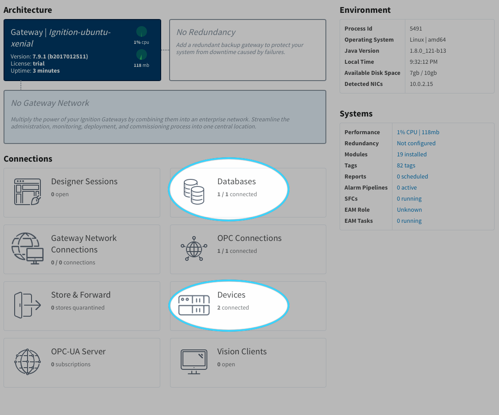

# Evaluation Instructions

Once you have your development environment setup and you can access the Ignition Gateway Webpage, you're ready to create your demo project and complete the evaluation!

We'll refer to a few constructs in the remainder of the guide:

| Name                | Description                              |
| ------------------- | ---------------------------------------- |
| Gateway Web Page    | Hosted on Port 8088 of the Ignition Gateway |
| Gateway Status Page | This is the *Status* page off of the *Gateway Web Page* |
| Gateway Home Page   | This is the *Home* page off of the *Gateway Web Page* |
| Gateway Config Page | This is the *Configuration* page off of the *Gateway Web Page* |
| Designer            | Primary Application Development Environment for Ignition |
| Project             | One or more projects can exist on an Ignition Gateway server |
| Client              | Web-Launched Client for a given Ignition Project |

## Setting up Device and Database Connections

Before we actually dive into the creation of a GUI application, we'll get some preliminary items setup.

1. Create/Configure a database connection called `ignition`.  The connection should use MySQL against the `ignition` database with username `ignition` and password `ignition`.
2. Create/Configure two *Generic Simulator* devices, one named `Device1`, another named `Device2`.

The Gateway status page should now reflect the new database connection and simulated devices:

## Setting up Alarm Journaling and Project Auditing

In order to make sure we can view some trended data from our simulated devices in our project, lets also setup our history connections:

1. From the *Gateway Config Page*, configure a new Alarm Journal profile called `Journal` against our `ignition` database we created in the last section.
2. Also create an Audit Profile called `Audit` within the `ignition` database as well.  Adjust the table name to be the lowercase `audit_events` for consistency with other Ignition default table names.

## Creating an Application

Next, we're going to create a baseline application to house our visualization and tag definitions:

1. Use the *Launch Designer* link on the *Gateway Web Page* to open the Designer.
2. Create a project called `Evaluator` using one of the *Single-Tier* navigation templates that will provide us with menuing and navigation preconfigured.

Lets perform some customizations and prepare a new window for our evaluation:

1. Create a new *Main Window* in the `Main Windows` folder called `Demo`.

2. Open the `Navigation` window from the *Project Browser*.

3. Remove the Ignition logo element and replace with the Evaluator Logo image:
   

4. Use the *Tab Strip Customizer* on the `Tabs` element to add a new tab called `Demo` for window we created above.

   > It should be placed in between the `Overview` and `User Management` tabs

5. Save and close the `Navigation` window.

Lets get started with our `Demo` window:

1. ​