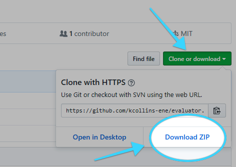
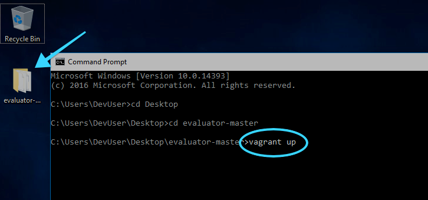
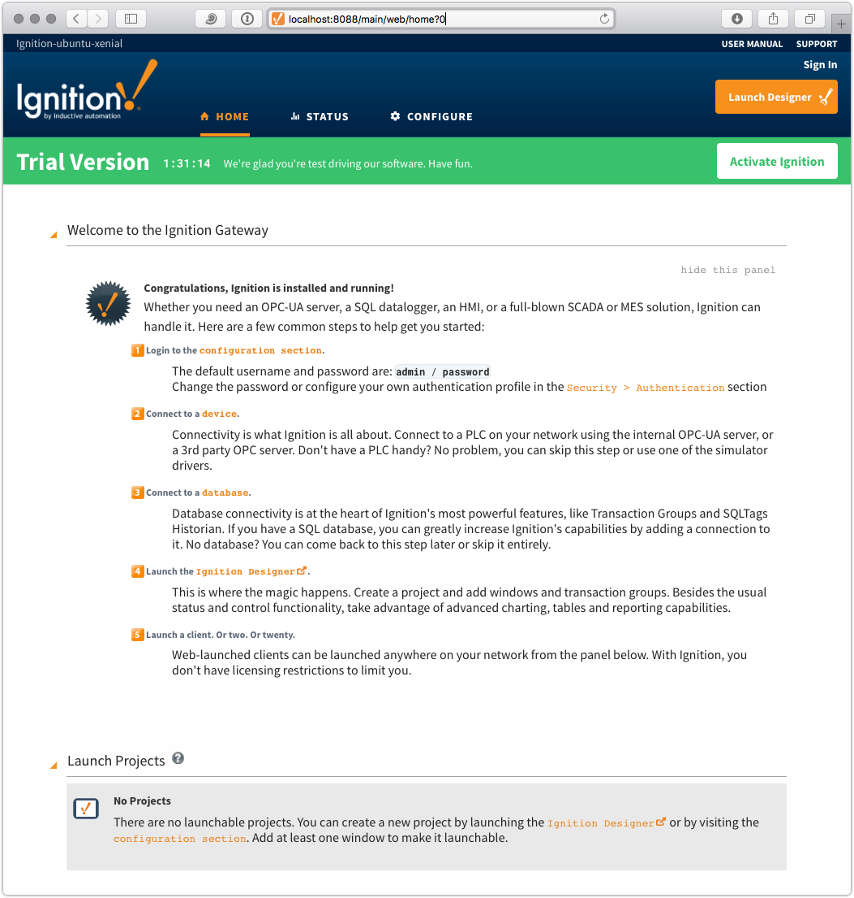

# Systems Integrator Skills Evaluator
This provides a simple set of exercises under the [Ignition](http://www.inductiveautomation.com) platform to establish a baseline capability for folks wanting to enter the industrial automation space as a Systems Integrator (SI).

## Prerequisites

* VirtualBox
  * **WARNING**: VirtualBox 5.1.16 has a known regression that breaks mounting of Shared Folders from Vagrant and will cause the provisioning to fail.  Downgrade to 5.1.14 for better operation.  VirtualBox[^1] and Vagrant[^2] are both tracking issues.
* Vagrant

## Getting Started

We're using [Vagrant](http://www.vagrantup.com) to handle the deployment of the environment.  Make sure that you have Vagrant installed by getting a download here:

https://www.vagrantup.com/downloads.html

You also need to have VirtualBox installed as the VM provider.  Get VirtualBox here:

https://www.virtualbox.org/wiki/Downloads

### Windows

If you don't have a `git` client, install *Git for Windows* and get not only `git` but also `ssh` (and more):

https://git-for-windows.github.io

First, download the repository to your computer (if you have `git` installed, you can clone as well):



Unpack the downloaded zip file, open a command prompt to the resulting location, and run `vagrant up`:



### Linux / macOS

First, open a terminal and clone this repository to your computer:

```bash
git clone https://github.com/kcollins-ene/evaluator.git
```

Next, start the environment:

```shell
cd evaluator
vagrant up
```
### All

Following the platform-specific steps above will create and provision an Ubuntu 16.04 development environment with Oracle Java8, MySQL, and Ignition 7.9.1 preinstalled.  Next, simply launch a web browser against the forwarded port on your local computer:

http://localhost:8088

If you see an Ignition Gateway Webpage, you're ready to go:



## Performing the evaluation

With your development environment online and ready, proceed to the [Evaluation](Evaluation.md) section for more instructions!

## Shutting down the environment

In order to shutdown the environment, run the following command in the `evaluator` folder:

```shell
vagrant halt
```

This will shutdown the virtual machine and release the network port configuration that was setup on launch.


[^1]: VirtualBox 5.1.16 Regression: https://www.virtualbox.org/ticket/14651

[^2]: Vagrant Shared Folder / Extended Path Issue: https://github.com/mitchellh/vagrant/issues/8352